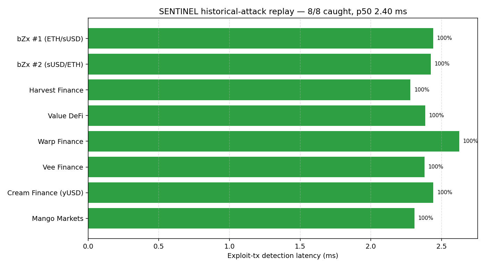
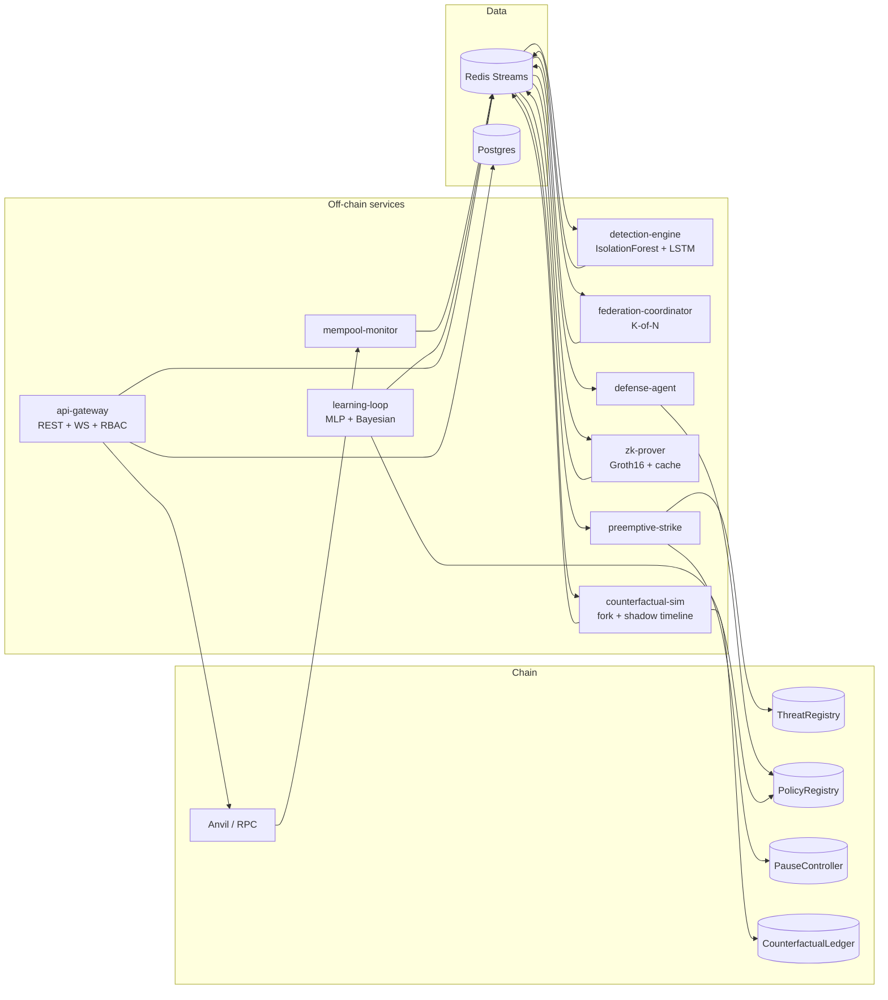

# SENTINEL v2

[](https://github.com/ch1kim0n1/hookemhacks26/actions/workflows/ci.yml)
[](./LICENSE)

> **We built the first blockchain of what *didn’t* happen.** DeFi loses billions a year to mempool-level exploits. SENTINEL stops the attack before the chain records it — then proves, with Groth16, the exact funds that would have been lost without the defense.

**What this is (beyond “another DeFi security tool”).** The reusable primitive is **cryptographically bound autonomous agents**: every defense action is tied to a specific policy, model commitment, and ZK proof. DeFi is the first customer because attacks and TVL are public and measurable; the same pattern applies anywhere an AI agent takes a consequential action (RWA settlement, insurance, compliance workflows).

**Autonomous Threat Intelligence Protocol** for DeFi. SENTINEL watches the mempool, predicts attacks before they land on-chain, reacts within a single block, and proves — cryptographically — what would have happened if it hadn’t.

## What it does

A six-layer defense stack. Each layer is wired end-to-end and ships with tests.

| Layer | Capability |
|-------|-----------|
| **1 — Mempool monitoring** | Streams pending txs from Anvil/RPC into Redis, extracts features (selector, value, sender pattern, gas) |
| **2 — Detection engine** | Scikit-learn **IsolationForest** + PyTorch **LSTM sequence detector** over a 4-state confidence machine (`IDLE → FLASH_LOAN_OBSERVED → ORACLE_IMPACT_OBSERVED → CONFIRMED`) |
| **3 — Federation coordinator** | K-of-N quorum across 3 detection operators with distinct `ModelRegistry` identities; co-located containers for the hackathon demo, distributed-ready architecture (see [docs/judge-qa.md#federation-topology](./docs/judge-qa.md#federation-topology)) |
| **4 — Counterfactual simulator** | Forks Anvil at the pre-attack block, replays the attack in a shadow timeline, computes per-account balance deltas + SHA-256 Merkle root of leaves |
| **5 — ZK prover** | RISC Zero guests for PolicyCompliance, CounterfactualCorrectness, and LearningLoopCorrectness; real Groth16 seals; two-tier proof cache (L1 LRU + L2 Postgres) |
| **6 — Defense + Preemptive strike** | `defense-agent` submits verified defense txs via `PolicyRegistry.verifyAndExecute`; `preemptive-strike` fires `PauseController` **before** a matched attacker tx is mined |
| **7 — Learning loop** | Red agent (Bayesian / Gaussian-process search) vs Blue agent (real **MLP neural net**, trained with backprop each generation) on a physics-backed constant-product attack simulator |

### Key features

- **Real ML, not heuristics.** Detection uses IsolationForest + PyTorch LSTM. The Red/Blue learning loop trains an actual multilayer perceptron per generation — manual backprop, SGD with momentum, He init, L2 regularization — against a physics model of flash-loan slippage. Training telemetry (loss, accuracy, precision, recall, FPR) streams to the UI live.
- **Preemptive defense.** `preemptive-strike` matches attacker address + 4-byte selector in the mempool and pauses the victim protocol before the attack lands. It also seeds cross-protocol immunity from confirmed detections, publishes signatures to the on-chain `ThreatRegistry`, and propagates to sibling protocols via federation.
- **ZK-backed authority.** Every defense action is gated by a Groth16 proof that the policy was satisfied. Every counterfactual is a 5-slot journal commitment bound to a real historical block hash.
- **On-chain inference.** The PolicyCompliance guest runs a linear classifier (weights committed in `policyHash`) *inside* the zkVM against the evidence features. No proof is produced unless the model's score clears the policy's threshold, so the on-chain verifier is cryptographically bound to the exact model that ran. See [zk/guest/policy-compliance/README.md §5](./zk/guest/policy-compliance/README.md#on-chain-inference-5).
- **Fail-closed agent.** An unauthorised instruction fails at the zkVM, not in application code — the guest refuses to produce a seal, so no defense tx is sent. The cue pipeline surfaces it as **"FAIL CLOSED — policy proof refused."** Optional opt-in human approval gate (`SENTINEL_REQUIRE_APPROVAL=1`) blocks high-confidence defenses on an `asyncio.Event`; inaction times out as a synthetic reject — fail-closed by construction. War-demo-room surfaces an amber countdown banner with Approve/Reject buttons wired to `POST /api/v1/approvals/:eventId/{approve,reject}`.
- **Signed evidence export.** `GET /api/v1/evidence/:eventId/export` bundles detection → defense → counterfactual → ledger (+ approval record) into canonical JSON, SHA-256 digests it, and signs with ECDSA-secp256k1 so an auditor can verify offline.
- **Operator-ready infra.** Redis Sentinel HA (production profile), Postgres migrations with checksums + drift detection, Anvil port-pool allocation for concurrent forks, a startup `eth_getCode` probe that fails fast when `config/addresses.local.json` is stale, JWT + RBAC auth with audit log.
- **Live demo.** `/demo` route + `/api/v1/demo/*` endpoints orchestrate the 90-second pitch (detection → counterfactual → proof → ledger) and a dedicated preemptive-strike flow.

## Benchmarks

Replay of the kill-chain signatures of **8 real DeFi exploits** (bZx #1 & #2, Harvest, Value DeFi, Warp, Vee, Cream-yUSD, Mango Markets — combined losses **$320.7M**) through the detection engine:

| Metric | Result |
|---|---:|
| **Attacks caught** | **8 / 8** (100%) |
| **$ would have blocked** | **$320.7M / $320.7M** (100%) |
| **Detection latency (p50)** | **2.40 ms** |
| **Detection latency (p95)** | **2.62 ms** |
| **Confidence** | **100%** on every attack |
| **False positives** | **0 / 500** benign txs (0.000%) |
| **Throughput** | **~385 tx/s** on a single operator |



> **Benchmark note — observed run, bounded claim, artifact-backed timing.**
> The numbers above are a measured replay of 8 historical exploit kill-chains reconstructed from public post-mortems, fed through the detection engine in isolation. Single operator, seed 1337, 500-tx benign control set. This is what the detector saw on these inputs — not a promise about unknown future attacks, and it does not include mempool-propagation latency from the live network. The JSON artifacts are checked into `bench/results/` so a reviewer can reproduce the run byte-for-byte.
>
> **Selector-flag ablation:** with `is_known_selector` forced to `False` across every attack tx, the catch rate is still **8/8** with **0/500** FPs (`bench/results/ablation.json`). The detection signal is the anomalous flash-loan + oracle-deviation state chain, not a hardcoded 4-byte lookup.

Full methodology, per-attack table, and raw JSON: [bench results](./services/detection-engine/bench/results/historical_attacks.md). Reproduce with:

```bash
cd services/detection-engine && poetry install && poetry run python -m bench.run
```

## Quick start

```bash
git clone https://github.com/ch1kim0n1/hookemhacks26.git
cd hookemhacks26
cp .env.example .env
pnpm install
docker compose up -d           # anvil + redis + postgres + 13 services
pnpm dev                       # frontend dev server
# UI:    http://localhost:3000
# Demo:  http://localhost:3000/#/demo · Bench UI: http://localhost:3000/#/bench
# API:   http://localhost:8080/api/v1/health
```

Detailed prereqs: [docs/setup-checklist.md](./docs/setup-checklist.md). Production (Redis Sentinel HA + Caddy TLS + rate limit) uses `docker compose --profile production up`.

## Demoing

One-click inside the UI: open `/demo`, click **Replay**. Or trigger from the CLI:

```bash
./scripts/replay-scenario.sh --list          # see every scenario
./scripts/replay-scenario.sh flash-loan-oracle   # Scenario A — full detection → counterfactual → defense → ledger
./scripts/replay-scenario.sh agent-constraint    # Scenario B — operator-injected unknown pattern, proof fails
./scripts/replay-scenario.sh preemptive-strike   # attacker tx paused before it mines
```

**15 scenarios** in total — 5 benign (routine swap, LP deposit, policy update, operator onboarding, learning-loop win) and 10 attacks (flash-loan, reentrancy, sandwich MEV, oracle flood, governance hijack, operator collusion, signature replay, dust spam, agent-constraint, preemptive-strike). Menu, severity, and expected outcomes: [config/demo-scenarios/README.md](./config/demo-scenarios/README.md).

**Presenter crib sheet:** [docs/demo-script-trimmed.md](./docs/demo-script-trimmed.md) — 3 wow moments, 90 seconds, one sentence per moment. Everything else is Q&A material.

The full exhaustive choreography is in [absolute-docs/12_demo_playbook.md](./absolute-docs/12_demo_playbook.md); the two-machine adversary vs. defender theatre in [demo/README.md](./demo/README.md).

## Architecture



## Repository layout

| Path | Purpose |
|------|---------|
| [contracts/](./contracts) | Foundry Solidity — nine core contracts + verifier wrappers ([README](./contracts/README.md)) |
| [services/](./services) | 6 TypeScript + 3 Python microservices, each with its own README ([overview](./services/README.md)) |
| [frontend/](./frontend) | Vite mission control; `/demo` route with live training metrics, counterfactual timeline, ImmunityMap |
| [zk/](./zk) | RISC Zero host + 3 guest crates ([README](./zk/README.md), [BENCHMARKS](./zk/BENCHMARKS.md), [VERIFIER_KEYS](./zk/VERIFIER_KEYS.md)) |
| [schemas/](./schemas) | JSON Schemas for every Redis-bus event + fixtures + validator ([README](./schemas/README.md)) |
| [packages/](./packages) | Shared TypeScript libraries (logger, stream-client) ([README](./packages/README.md)) |
| [config/](./config) | Addresses, timings, demo scenarios ([15 scenarios](./config/demo-scenarios/README.md)), ZK image IDs, Redis Sentinel HA config |
| [scripts/](./scripts) | Bootstrap, pre-warm proofs, verify, scenario triggers, backup/restore ([README](./scripts/README.md)) |
| [infra/](./infra) | Prometheus, Grafana, Docker configs ([README](./infra/README.md)) |
| [docs/](./docs) | Operational docs, runbooks, judge QA ([README](./docs/README.md)) |
| [absolute-docs/](./absolute-docs) | Canonical system specification (architecture, APIs, ZK, demo playbook) |

## Verification

```bash
pnpm verify              # timings + streams + demo scripts + addresses + schemas
pnpm validate:schemas    # subset — just schemas + fixtures
pnpm test                # vitest across all TS services (220+ tests)
pnpm contracts:test      # forge test
pnpm test:python         # pytest for detection-engine, defense-agent, federation-coordinator
cd zk && cargo test      # RISC Zero guests (dev mode, fast)
```

CI additionally runs a `zk-full` job (real Groth16 proofs) on the `full-zk` PR label or release tags.

## Engineering docs

- **[absolute-docs/](./absolute-docs)** — canonical system spec; start with [00_executive_overview.md](./absolute-docs/00_executive_overview.md)
- **[docs/IMPLEMENTATION_STATUS.md](./docs/IMPLEMENTATION_STATUS.md)** — living spec-vs-code map
- **[docs/judge-qa.md](./docs/judge-qa.md)** — judge-facing Q&A
- **[docs/built-this-weekend.md](./docs/built-this-weekend.md)** — hackathon scope checklist (fill in for judges)
- **[docs/DEPLOY_TESTNET.md](./docs/DEPLOY_TESTNET.md)** — optional public testnet deploy
- **[docs/post-hackathon-roadmap.md](./docs/post-hackathon-roadmap.md)** — what's done / partial / future
- **[docs/setup-checklist.md](./docs/setup-checklist.md)** — exact tool versions

## License

MIT — see [LICENSE](./LICENSE).
