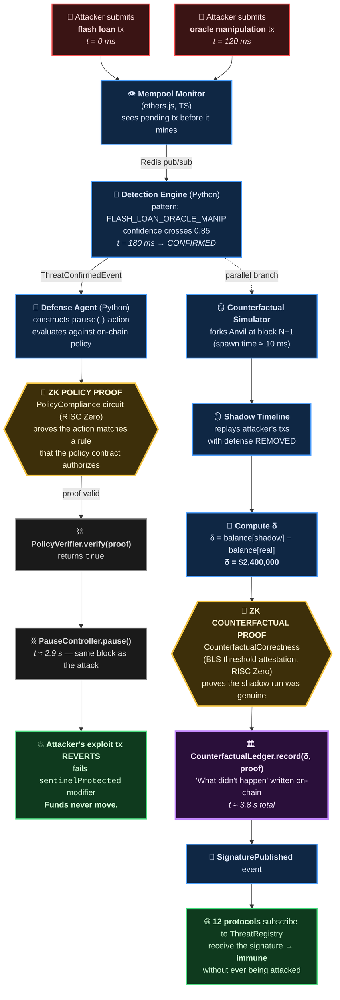
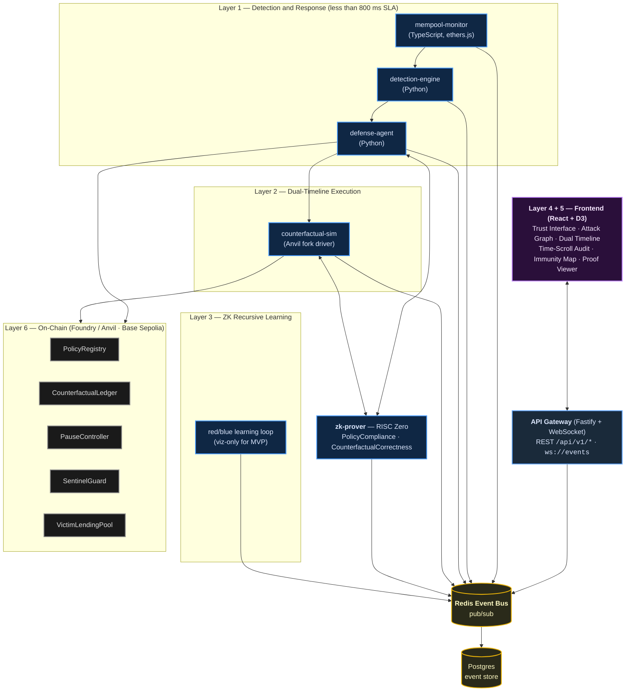

# SENTINEL v2 — How It Works (Judges)

> **The blockchain that records not just what happened, but what *didn't* happen.**
>
> Autonomous DeFi defense, faster than any human, with cryptographic proof of prevented loss.

---

## 1. The 90-Second Demo — End-to-End Flow

This is exactly what you see on screen during the pitch. Every arrow is a real network hop, Redis message, or on-chain transaction.

**Read this as two tracks:**
- **Left spine:** real chain — attack is stopped in-block.
- **Right spine (dashed entry):** a forked chain replays what *would* have happened. The δ is what the attacker would have taken.

Both tracks close with a **ZK proof** so the on-chain record is unforgeable. Total wall-clock: **~3.8 s** from first malicious tx to "what didn't happen" committed to the ledger.

---

## 2. The Math That Stops the AI — Agent Constraint Failure

We demonstrate this live by **deliberately trying to make the defense agent misbehave**. The point of this branch: the agent is *structurally* incapable of acting outside its mandate. It's not a check — it's a load-bearing wall.

```mermaid
flowchart LR
    classDef op fill:#3a1414,stroke:#ff5555,color:#ffdddd,stroke-width:2px
    classDef sentinel fill:#0f2744,stroke:#4a9eff,color:#dde8ff,stroke-width:2px
    classDef zk fill:#3d2f0a,stroke:#f5c542,color:#fff5d6,stroke-width:3px
    classDef chain fill:#1a1a1a,stroke:#888,color:#ddd,stroke-width:2px
    classDef block fill:#3a0f0f,stroke:#ff4444,color:#ffcccc,stroke-width:3px

    I["🕴 Operator injects malicious instruction<br/><code>drainFunds(to=attacker)</code>"]:::op
    AG["🤖 Defense Agent<br/>builds tx, evidence.pattern = OPERATOR_OVERRIDE<br/><b>does NOT short-circuit</b>"]:::sentinel
    ZP["🔐 ZK Prover<br/>PolicyCompliance circuit runs<br/><code>policy.rules.find(OPERATOR_OVERRIDE)</code><br/><b>→ no such rule → proof FAILS</b>"]:::zk
    SUB["🤖 Agent submits anyway<br/>with empty proof bytes<br/>(to prove the on-chain guard)"]:::sentinel
    REJ["⛓ PolicyVerifier.verify() → <code>false</code><br/>PolicyRegistry reverts<br/><code>INVALID_PROOF</code>"]:::chain
    STOP["🛑 <b>Math stopped it.</b><br/>Action cannot be proven → cannot land."]:::block

    I --> AG --> ZP --> SUB --> REJ --> STOP
```

> This is the only demo moment where **failing is winning**. A defense that reverts on a forged proof is the security property we ship.

---

## 3. System Architecture — The Six Layers

For judges who ask "what's actually running?" (doc 01).

---

## 4. Why This Is Different From Any Bot

| A normal ethers.js defense bot | SENTINEL v2 |
|---|---|
| Watches events, calls `pause()` | **ZK-bounded agent** — architecturally incapable of unauthorized action |
| Logs that "an attack happened" | **Counterfactual proof** — quantifies prevented loss *on-chain* |
| Single-protocol reactive | **Dual-timeline simulation** — an alternate-history state root |
| Isolated to one deployment | **Compounding network immunity** via threat registry |

---

## 5. One-Sentence Pitch

> **"SENTINEL defends protocols autonomously faster than any human can — and cryptographically proves what would have happened without it."**
